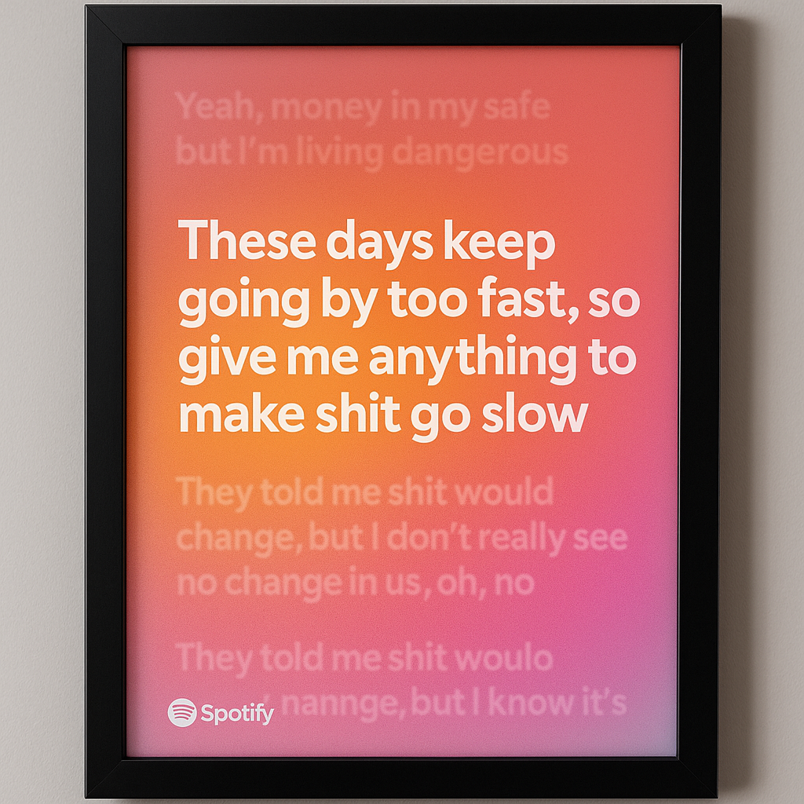

# Smart Lyric Frame

Smart Lyric Frame is a local web application that syncs with your Spotify account to display real-time lyrics in a stylized, framed format. Designed with the visual goal of mimicking etched or dimensional text, the display is intended to blend physical elegance with digital playback.

---

## Features

- Connects to your Spotify account using OAuth
- Displays currently playing track's lyrics
- Supports `.lrc` files for time-synced lyrics
- Smooth transitions between current, previous, and upcoming lyric lines
- Designed for transparent or backlit display surfaces
- Ideal for art builds using LCD panels and frosted acrylic

---

## Visual Concept

The current lyric is displayed with a glowing, carved-glass aesthetic, while previous and upcoming lines are subtly styled to give a flowing effect.  



---

## Getting Started

### Prerequisites

- Python 3.10+
- A Spotify Developer account
- A Genius API access token (for optional lyric fallback)

### Installation

```bash
git clone https://github.com/armgill/Smart_Lyric_Frame.git
cd Smart_Lyric_Frame

python3 -m venv venv
source venv/bin/activate

pip install -r requirements.txt
```

### Setup Environment Variables

Create a `.env` file with your credentials:

```env
SPOTIPY_CLIENT_ID=your_client_id
SPOTIPY_CLIENT_SECRET=your_client_secret
SPOTIPY_REDIRECT_URI=http://localhost:5000/callback
GENIUS_ACCESS_TOKEN=your_genius_token
```

### Run the App

```bash
python app.py
```

Then open [http://localhost:5000](http://localhost:5000) in your browser.

---

## File Structure

```
smart_lyric_frame/
├── app.py
├── requirements.txt
├── .env
├── templates/
│   └── index.html
├── static/
│   └── style.css
├── lyrics/
│   └── sample.lrc
└── images/
    └── concept.png
```

---

## License and Usage

This project is for personal or academic use only. Redistribution, reproduction, or commercial use is not permitted without explicit permission from the author.
